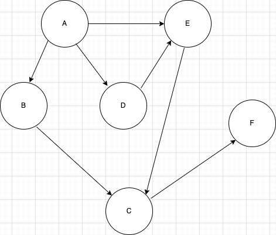

## 들어가며

데브코스 2주차가 시작됐다. 오늘도 여전히 자료구조와 알고리즘을 공부했다. 크게 DFS/BFS 와 그리디 알고리즘에 대해 공부했다. 관련 코딩테스트 연습 문제를 푸는데 오늘 하루가 다 지나간 것 같다. 총 두 문제를 풀었는데 한 문제에 5시간을 쏟는 바람에 나머지 한 문제는 집중력이 다 떨어져서 제대로 풀지 못했다. 코딩테스트 잘 푸는 사람들 보면 신기하다. 나도 잘 풀고 싶다.

## BFS (너비 우선 탐색)

BFS는 Breadth First Search의 약자로 너비 우선 탐색을 의미한다. 그래프가 주어졌을 때 시작 정점부터 같은 깊이에 해당하는 정점을 우선으로 탐색하는 알고리즘이다. 아래와 같은 그래프가 있다고 생각해보자.


시작 정점이 A라고 가정 했을 때 먼저 A를 방문하고 그 다음 A와 인접한 정점인 B, D,
F 정점을 방문한다. 그 후, 다음으로 인접한 정점 C를 방문하고 마지막으로 E를 방문한다.
최종적으로 탐색 순서는 `A-B-D-F-C-E` 순이다. BFS의 목적은 임의의 정점에서 시작해서
모든 정점을 한번씩 방문하는 것이다.

BFS는 어떻게 구현할 수 있을까? 가까운 정점을 저장해놓고 순서대로 방문해야 하기 때문에 **큐** 자료구조를 사용해 구현한다.

```javascript
function bfs(graph, startNode) {
  const queue = [];
  const visited = [];
  queue.push(startNode); // 시작 노드를 큐에 넣음
  while (queue.length !== 0) {
    const node = queue.shift();
    if (!visited.includes(node)) {
      visited.push(node);
      queue.push(...graph.get(node)); // 현재 노드와 인접한 노드들을 큐에 추가
    }
  }
  return visited;
}

console.log(bfs(graph, "A")); // ["A", "B", "D", "F", "C", "E"]
```

## DFS(깊이 우선 탐색)

DFS는 Depth First Search의 약자로 BFS와 다르게 최대한 깊은 정점부터 탐색하는 알고리즘이다. BFS에서 살펴 본 그래프와 같은 구조의 그래프가 있다고 했을 때 시작 정점을 A라고 하면 먼저 A를 방문하고 다음으로 B, C, E를 방문하고, 정점 E에서 더 이상 갈 수 있는 정점이 없기 때문에 다시 A 정점으로 돌아와 D를 방문하고 마지막으로 F를 방문하면서 탐색이 종료된다. 따라서 탐색 순서는 `A-B-C-E-D-F` 순이다. E에서 A로 돌아갈 때 방문했던 정점들을 따라 되돌아 가는데 이 방식이 **스택**의 동작방식과 비슷하기 때문에 구현을 위해 스택을 사용한다. 또, 대부분의 언어에서 재귀함수가 내부적으로 스택으로 구현되어 있기 때문에 재귀함수를 사용해서 구현하기도 한다.

```javascript
function dfs(graph, startNode) {
  const stack = [];
  const visited = [];
  stack.push(startNode);
  while (stack.length > 0) {
    const node = stack[stack.length - 1];
    if (!visited.includes(node)) {
      visited.push(node);
      if (graph.has(node)) {
        let data = graph.get(node).shift();
        while (visited.includes(data)) {
          data = graph.get(node).shift();
        }
        if (data !== undefined) {
          stack.push(data);
        } else {
          stack.pop();
        }
      }
    } else {
      if (graph.has(node) && graph.get(node).length === 0) {
        stack.pop();
      } else {
        stack.push(graph.get(node).shift());
      }
    }
  }
  return visited;
}

console.log(dfs(graph, "A")); //
```

다른 사람 코드를 보면 엄청 간단하게 구현한 것 같은데 내 코드는 왜이리 긴 건지 모르겠다. 먼저 나는 스택을 사용해 구현했다. 시작 정점을 스택에 넣고 해당 정점과 인접한 정점 중 우선순위가 가장 높은 정점을 스택에 넣는다. 방금 스택에 넣은 정점을 기준으로 다시 해당 정점에서 우선순위가 높은 정점을 방문하는 과정을 반복한다.

## 탐색 실습

프로그래머스의 [여행경로](https://programmers.co.kr/learn/courses/30/lessons/43164) 문제를 풀어보았다. 약 5시간 동안 풀었는데 결국 해결하지 못하고 다른 사람이 작성한 코드를 참고했다. 테스트 케이스 1번만 틀리길래 좀 더 하면 풀릴 줄 알았지만 아니었다. 나는 스택을 문제를 풀려고 했는데 제대로 이해하지 못한 탓인지 탐색 조건을 설정하는 게 어려웠다.

- 다른 사람의 코드를 참고해 작성한 내 코드

```javascript
function solution(tickets) {
  let routes = [];

  function dfs(extra, current, route) {
    if (extra.length === 0) {
      routes.push(route);
    } else {
      extra.forEach(([dep, arr], index) => {
        if (current === dep) {
          let newExtra = extra.slice();
          newExtra.splice(index, 1);
          dfs(newExtra, arr, route.concat(arr));
        }
      });
    }
  }
  dfs(tickets, "ICN", ["ICN"]);
  return routes.sort()[0];
}
```

재귀를 사용한 DFS로 문제를 풀었다. 전체적인 풀이 방법은 내가 생각한 방법이랑 비슷한 것 같은데 어떤 부분에서 틀린건지 잘 모르겠다😥 며칠 뒤에 다시 풀어봐야겠다.

## 그리디

매 선택에서 지금 이 순간 가장 최적인 답을 선택하는 알고리즘이다. 보통 최적해를 구하는 알고리즘보다 빠른 경우가 많다. 그리디 알고리즘은 그 순간에 최적의 값을 찾기 때문에 전체적으로 봤을때는 최적의 값을 찾지 못하는 경우도 있다. 그러나 그리디 알고리즘으로 풀 수 있는 문제들은 순간에 최적인 값을 찾아 답을 구하면 전체적으로도 최적인 값을 찾을 수 있는 문제이다.

## 그리디 실습

프로그래머스의 [큰 수 만들기](https://programmers.co.kr/learn/courses/30/lessons/42883) 문제를 풀었다. 처음 내가 문제에 접근한 방식은 문자열에서 제일 작은 값을 찾아 제거할 문자의 갯수 만큼 제거했다. 테스트 케이스 1, 2번은 해결했지만 3번에서 틀려서 다른 방법을 찾아야했다. 이미 앞에서 풀었던 여행경로 문제에 에너지를 너무 쏟아서 빠르게 포기하고 해설을 봐버렸다. 주어진 문자열을 순회하면서 숫자를 스택에 저장한다. 저장하는 과정에서 스택의 _top_ 의 값이 스택에 들어올 숫자보다 작으면 _pop_ 을 해준다. 이 과정을 반복하면 가장 큰 수를 찾을 수 있다. 그리디는 직관적인 문제에 사용할 수 있다고 하는데 그 직관을 키우기 위해 많은 문제를 풀어봐야겠다.

```javascript
function solution(number, k) {
  const stack = [];
  let count = 0;
  for (const item of number) {
    while (count < k && stack[stack.length - 1] < item) {
      stack.pop();
      count++;
    }
    stack.push(item);
  }
  while (count < k) {
    stack.pop();
    count++;
  }
  return stack.join("");
}
```

## 정리

자료구조와 알고리즘 지식이 점점 늘고 있다. 프로그래머스 문제는 2단계도 아직 다 못 풀었는데 어느 순간 3단계 문제를 풀고 있다. 점점 문제 푸는 시간이 늘어나면서 공부에 쏟는 시간이 좀 줄어든 느낌이다. 공부하는 시간과 코딩테스트 푸는 시간을 적절히 분배해서 둘 다 공부할 수 있게 노력해야겠다.

## TMI

1. 오늘 1주차 과제에 대한 멘토님의 피드백을 받았다. 아직 많이 부족한 코드인데 엄청 정성스럽게 댓글을 달아주셨다. 처음 PR 해본거라 떨렸는데 이정도면 첫 과제는 무난하게 통과한 것 같다. 그래도 고칠 점을 많이 달아주셔서 내일은 시간 내서 어떤 부분이 부족한지 살펴 볼 계획이다.
2. 오늘 밤 열두시면 드디어 격리해제다. 그동안 방안에만 있느라 힘들었는데 내일은 밖에 나가서 산책하면서 힐링 좀 해야겠다.

## 참고자료

깊이 우선 탐색 https://velog.io/@polynomeer/%EA%B9%8A%EC%9D%B4-%EC%9A%B0%EC%84%A0-%ED%83%90%EC%83%89DFS  
너비 우선 탐색 https://velog.io/@polynomeer/%EB%84%88%EB%B9%84-%EC%9A%B0%EC%84%A0-%ED%83%90%EC%83%89BFS  
여행 경로 풀이 https://grahams.tistory.com/388?category=717173  
그리디 알고리즘 https://hanamon.kr/%EC%95%8C%EA%B3%A0%EB%A6%AC%EC%A6%98-%ED%83%90%EC%9A%95%EC%95%8C%EA%B3%A0%EB%A6%AC%EC%A6%98-greedy-algorithm/
