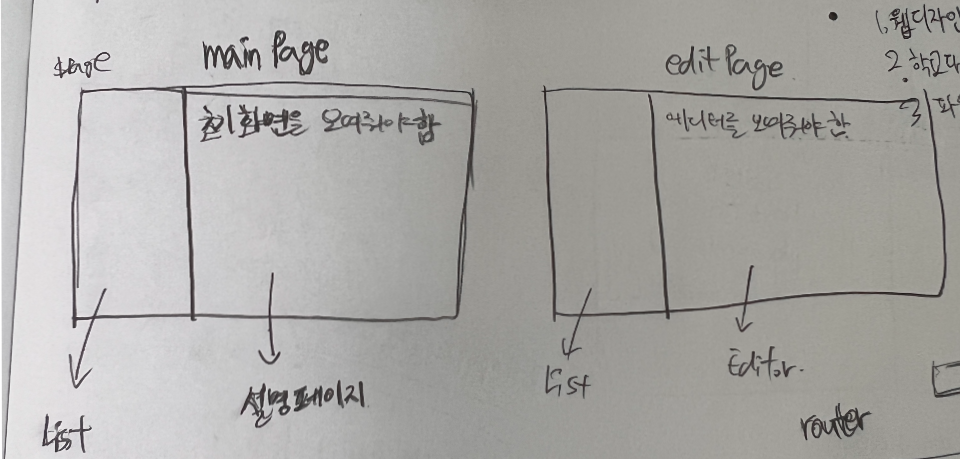
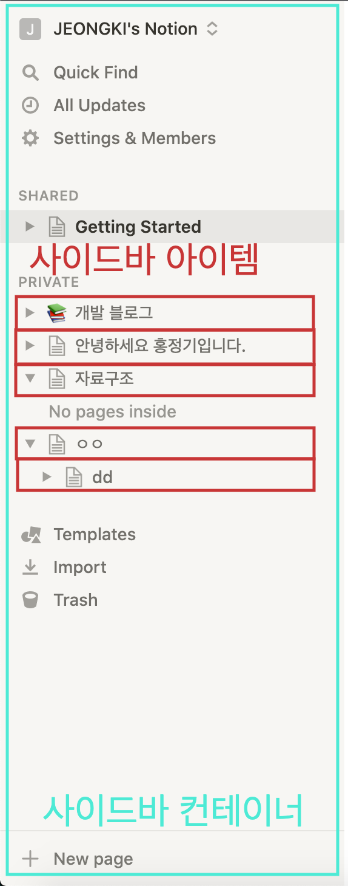

## 들어가며

데브코스 1기 분들 후기를 통해 알게 되었던 공포의 노션 클로닝 프로젝트가 끝이 났다. 사실 지나고 보니 엄청난 공포는 아니었던 것 같다. 잠을 많이 못 잔 것만 빼면 괜찮았던 것 같다. 2022-04-12부터 2022-04-20까지 일주일 조금 넘는 시간동안 프로젝트를 진행하며 겪었던 일을 정리해보고자 한다. 첫째 날부터 일자별로 정리하면 정말 좋겠지만 빨리 구현해야한다는 압박감 때문에 하나도 정리하지 못했다... 다음에는 하루 회고도 진행하면 정말 좋을 것 같다.

## 폴더 구조

┣ 📂src  
┃ ┣ 📂api  
┃ ┃ ┣ 📜get-documents.js  
┃ ┃ ┣ 📜get-one-document.js  
┃ ┃ ┣ 📜index.js  
┃ ┃ ┣ 📜modify-document.js  
┃ ┃ ┣ 📜remove-document.js  
┃ ┃ ┗ 📜set-new-document.js  
┃ ┣ 📂components  
┃ ┃ ┣ 📂Editor  
┃ ┃ ┃ ┣ 📜Breadcrumb.js  
┃ ┃ ┃ ┣ 📜Editor.js  
┃ ┃ ┃ ┣ 📜EditorContainer.js  
┃ ┃ ┃ ┗ 📜RichEditorTitle.js  
┃ ┃ ┣ 📂Sidebar  
┃ ┃ ┃ ┣ 📜DocumentsList.js  
┃ ┃ ┃ ┣ 📜NewButton.js  
┃ ┃ ┃ ┣ 📜SidebarContainer.js  
┃ ┃ ┃ ┗ 📜SidebarTitle.js  
┃ ┃ ┣ 📜App.js  
┃ ┃ ┗ 📜SavingIndicator.js  
┃ ┣ 📂constants  
┃ ┃ ┣ 📜api-constants.js  
┃ ┃ ┣ 📜class-constants.js  
┃ ┃ ┣ 📜index.js  
┃ ┃ ┣ 📜notion-icons.js  
┃ ┃ ┗ 📜query-constants.js  
┃ ┣ 📜main.js  
┃ ┗ 📜router.js  
┣ 📜README.md  
┣ 📜index.html  
┗ 📜style.css

저번 주에 멘토님과 커피챗을 진행하면서 폴더 구조에 관한 얘기를 했었는데 깔끔하게 보일 수 있도록 폴더를 구분했다. _api_ 폴더는 HTTP 통신을 위한 함수를 모아 놓은 폴더이고, _constants_ 폴더는 반복적으로 사용하는 문자열들을 모아놓은 폴더이다. _api_ 와 _constants_ 폴더 내부에서 _index.js_ 라는 파일로 모든 변수를 관리한다. 이렇게 구성하면 외부에서 _api_ 나 _constants_ 내부의 변수를 참조할 때 _index.js_ 를 통해 폴더 내부의 모든 변수에 접근할 수 있다. 이와 [관련된 글](https://medium.com/@z_callan/javascript-project-architecture-constants-deddfde3c8a8)을 읽어보면 도움이 될 것 같다. 모든 컴포넌트는 _components_ 폴더에 저장했다.

## 컴포넌트 구조

최상위에 _App_ 컴포넌트가 있고, 하위에 사이드바, 에디터, SavingIndicator가 있다. 각각 컴포넌트의 하위에는 해당 컴포넌트를 구성하는 컴포넌트들로 이루어져 있다. 각 컴포넌트들은 아래에서 자세히 설명하도록 하겠다.

## 라우팅 기능

요구사항: 총 두 개의 url이 있다. _/_ 와 _/documents/{documentId}_ 이다. 첫 번째 url로 접근하면 왼쪽의 사이드바만 화면에 그려주고 두 번째 url로 접근하면 사이드바와 함께 오른쪽에 문서 편집이 가능한 편집기도 같이 그려준다.  
처음에는 어떤 방식으로 페이지를 구성해야 하는지 부터 고민했다. 두 개의 페이지를 만들고 루트 페이지와 에디터 페이지로 나눠 경로에 따라 다른 페이지를 그리는 방식을 먼저 생각했다.  

이 방식으로 하면 사이드바는 항상 고정된 위치에 있어야하는데 페이지가 변할 때마다 다시 렌더링을 해야한다. 다시 렌더링 하는게 불필요하다고 생각해서 이 방식은 사용하지 않았다. 대신 페이지를 하나만 구성해서 사이드바와 에디터를 미리 다 그려주고 url을 읽어 루트 경로일 경우에는 _display: none_ 을 사용해 에디터를 숨겨주는 방식을 선택했다. 이 방법이 좋은 방법인지는 잘 모르겠다.

## 사이드바

요구사항: 루트 문서가 먼저 화면에 그려지고, 하위문서는 좌측의 펼치기 버튼을 클릭하면 루트 문서 아래에 그려진다. 우측의 추가 버튼을 누르면 현재 문서의 하위에 문서를 추가하면 편집기를 띄워준다.  
사이드바를 구성하는게 프로젝트의 핵심이라고 생각했다. 처음엔 문서 트리를 어떻게 만들어서 그려줘야 할 지 고민했다. 컴포넌트는 최소 단위로 쪼개는 게 좋다고 생각해서 사이드바 컨테이너를 만들고 각각의 문서 컴포넌트를 만들어 구성하려고 했다.

그런데 바닐라 자바스크립트로 컴포넌트를 구성하는 방법이 아직 익숙하지 않다보니 재귀적으로
문서 컴포넌트를 그려주는 것 까지는 어찌저지 성공했는데 의도한 대로 동작하지 않았다.
오프라인 첫 날 하루를 써도 문제가 해결되지 않아서 슬픈 마음으로 집으로 돌아왔다.
그대로 하루를 끝내기엔 너무 아쉬워서 씻고 다시 책상에 앉았다.

새벽 1시를 넘어가던 시점에 갑자기 아이디어가 떠올랐는데 그냥 미리 하위 문서까지 포함된 html 코드를 재귀 함수를 통해 만들고, 만들어진 html 문자열을 그냥 _innerHTML_ 을 사용해 집어넣는 것이었다. 미리 완성된 html 코드를 만들고 하위 문서들은*display: none* 를 통해 조작했다.

## 에디터

요구사항: 편집기에는 기본적으로 저장 버튼이 없다. Document Save API를 이용해 지속적으로 서버에 저장되도록 한다.  
문서는 제목과 내용을 가진다. 제목과 내용이 수정될 경우 자동으로 서버에 저장이 되도록 에디터에 이벤트 리스너를 달아 _input_ 이벤트가 발생할 경우 서버에 저장하도록 했다. _input_ 태그를 사용할 경우 입력이 발생한 걸 _change_ 이벤트를 통해 알 수 있는데, _div_ 태그와 _contenteditable_ 을 사용한 경우 입력했을 때 _input_ 이벤트가 발생한다.  
매번 _input_ 이벤트가 발생할 때마다 서버에 저장하는 건 매우 비효율적이다. 그렇기 때문에 강의에서 배웠던 디바운싱을 적용했다. 리치한 에디터를 만들고 싶어서 노션과 같이 입력 div를 구성했다. 그런데 변하는 텍스트를 상태로 저장하고 그 상태를 다시 받아서 innerHTML로 설정해주다보니 innerHTML값을 변경할 때마다 커서가 앞으로 가는 문제가 있었다. 커서를 다시 뒤로 보내면 제대로 작동하지 않을까 싶어서 _window_ 의 _getSelection_ 메서드를 이용해 innerHTML 값을 변경하기 전 커서 위치를 저장하고 innerHTML을 통해 값을 변경하면 _getSelection_ 을 통해 얻은 selection 객체의 _collapse_ 메서드로 커서를 조작하는 방법을 생각했다. 이론은 완벽하다고 생각했는데 제대로 동작하지 않았다. 나도 모르는 상태 변경이 일어나서 예상하지 못한 부분에서 innerHTML의 변경이 일어나고, 상태 변경이 의도한 때에만 일어난다고 해도 한글 자음과 모음이 다 분리되어 입력 됐을 것 같다. 결국 해결 못함.

## 브레드크럼 (사용자 이동 경로?)

브레드크럼은 현재 사용자가 어디에 위치해 있는지 알려주는 컴포넌트이다. 노션을 보면 에디터 위쪽에 현재 문서의 경로를 나타내고, 클릭하면 해당 문서로 이동하는 기능을 가지고 있다. 이 기능을 구현하기 위해 서버에서 받아온 문서 데이터를 DFS를 사용해 현재 선택된 문서를 찾고 그때의 경로를 출력하는 방법을 생각했다. 그런데 알고리즘 공부가 부족한 탓인지 어떤 방식으로 해야할 지 전혀 생각이 나지 않았다. 결국 눈물을 머금고 DOM에서 부모노드를 찾아가는 방식을 사용해 구현했다. 에디터 영역의 상단에 현재 문서와 현재 문서의 부모노드가 렌더링 되는 것을 확인할 수 있다.

## SavingIndicator

이름은 거창하지만 하는 일은 거의 없다. 문서를 수정하면 자동으로 서버에 저장되도록 했는데 저장을 잘했는지 확인할 방법이 없었다. 그래서 화면 우측 하단에 서버에 저장하는 중일 경우 Saving... 이라는 문구를 출력해준다. 그런데 저장에 걸리는 시간이 짧아서 그런지 눈으로 확인하기 쉽지 않을 만큼 빠르게 사라지기 때문에 조금 아쉬운 것 같다.

## 프로젝트를 되돌아보며

살면서 처음으로 마감기한이 정해진 프로젝트 다운 프로젝트? 를 진행했던 것 같다. 그래서 그런지 일정을 세우는 방법도 몰랐고 마감기한을 맞춰야한다는 압박감 때문에 덮어놓고 구현만 했던 것 같아 아쉽다. 물론 취업을 하고 회사 프로젝트를 진행하게 되면 마감기한을 맞추는 게 정말 중요하겠지만, 지금은 공부하는 상황이고 프로젝트를 통해 하나라도 더 배워가는게 목표이기 때문에 진행과정과 겪었던 어려움을 기록하는 게 중요한 것 같다. 프로젝트 하면서 어려움도 많았고 해결한 것도 많았는데 기록해두지 않다보니 기억이 잘 안난다... 그래도 배운 점과 아쉬운 점을 정리해보자면

- 배운 점: 바닐라 js로 상태를 활용한 컴포넌트 형식으로 구현하는 것에 좀 더 익숙해졌다. 작년에 우아한테크캠프 2차 코딩테스트로 바닐라 js를 사용해 컴포넌트 형식으로 매장 관리 페이지를 구성하는 과제가 주어졌었다. 당시에는 공부를 시작한지 얼마 되지 않아서 컴포넌트로 구성하는게 어떤건지 잘 몰랐고, 프로그래머스의 고양이 사진첩 문제를 반복하면서 거의 코드를 암기하다시피 공부했다. 그때는 이해하지 못했던 방식을 이번 강의와 프로젝트를 통해 더 이해하게 된 것 같아 기분이 좋다. 프로젝트 폴더 구조를 좀 더 의식적으로 나누려고 했던 점도 칭찬하고 싶다. 또, 상태를 관리하고 어떻게 내려주는지를 내가 판단해서 제대로 동작하게 했다는 점도 뿌듯하다.
- 아쉬운 점: 예전보다는 컴포넌트 구성에 익숙해졌지만 아직도 부족한 것 같다. 컴포넌트를 내가 의도한 최소 컴포넌트로 쪼개지 못했고, 에디터도 기본 기능밖에 구현하지 못했다. 최소 컴포넌트로 쪼개는 건 지금 좀 더 시간을 투자하면 해결할 수도 있을 것 같은데 노션과 같이 더 다양한 기능을 제공하는 에디터는 아직도 어떻게 구현해야 할 지 감이 잡히지 않는다. 매일매일 회고를 진행하지 않은 점도 아쉽다. 매일 회고를 작성했다면 지금 작성하는 회고도 더 나한테 도움이 될 수 있었을 것 같아서 아쉽다. 알고리즘도 부족하다고 느꼈다. 브레드크럼 컴포넌트 만들 때 DFS 알고리즘을 적용할 수 있을 것 같아서 '이럴 때 알고리즘을 사용할 수 있구나' 하면서 혼자 싱글벙글했는데 정작 DFS를 구현 못해서 적용하지 못했다. 기본적인 자료구조와 알고리즘은 언제든 사용할 수 있도록 더 공부를 빡세게 해야겠다고 느꼈다. 의외로 CSS가 부족한 걸 많이 느꼈다. 마침 오늘 박영웅님 flex 세션을 통해 잘 만들어진 다른 사이트들의 디자인을 보면서 CSS 공부를 해야겠다고 느꼈다. 솔직하게 지금까지 CSS를 비중있게 공부해야겠다는 생각을 하지 않았던 것 같아 반성한다.

## 정리

어쨌든 노션 클로닝 프로젝트는 끝이 났다. 나아진 점도 있었고 아쉬운 점도 있었다. 나아진 점은 더 나아질 수 있게 노력하고, 아쉬운 점은 다음 프로젝트 때 만회할 수 있도록 노력해야겠다.

## 참고자료

https://medium.com/@z_callan/javascript-project-architecture-constants-deddfde3c8a8
