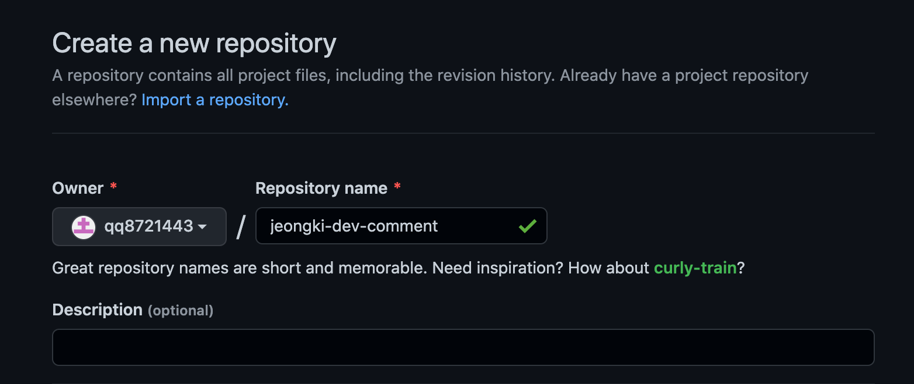
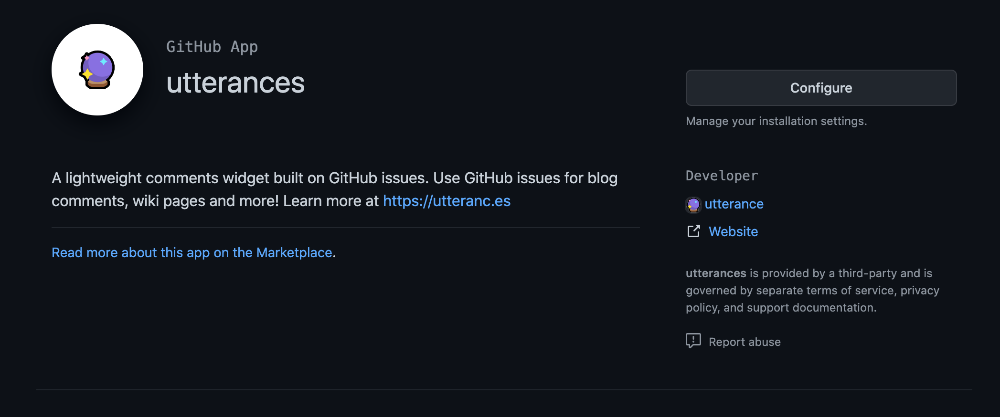
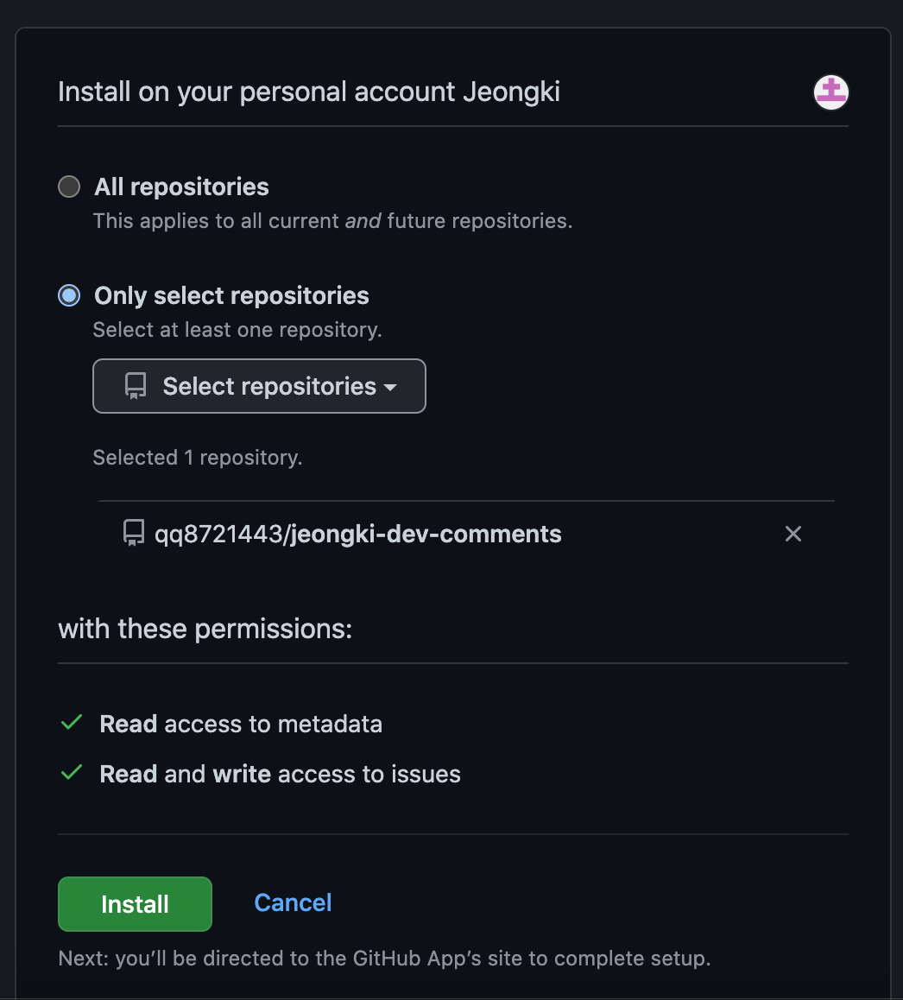
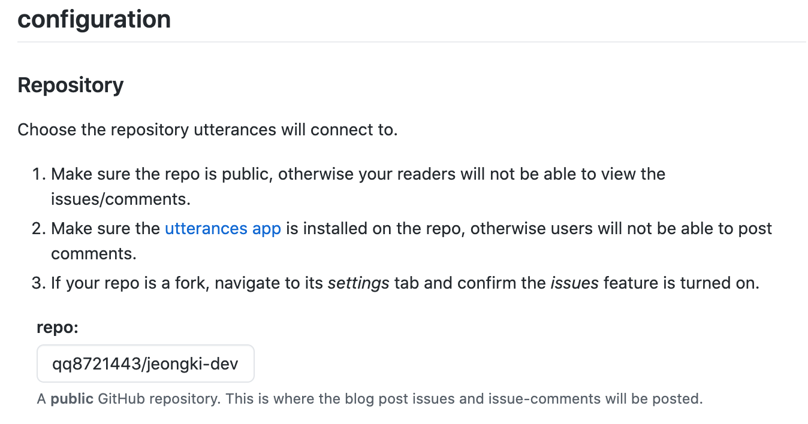
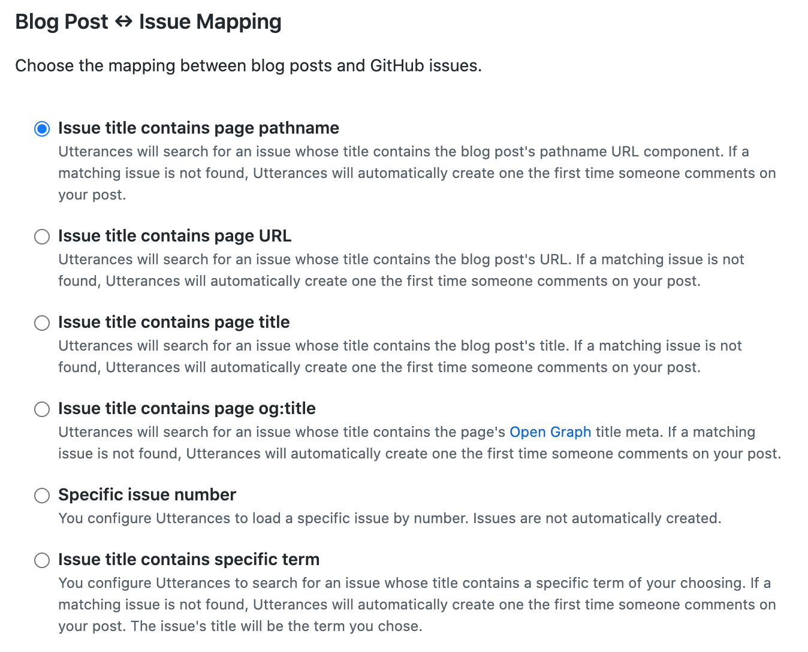
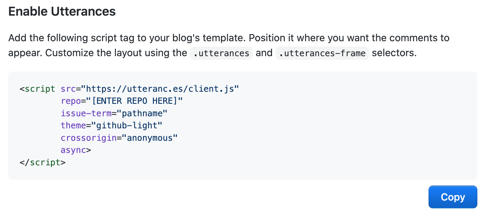
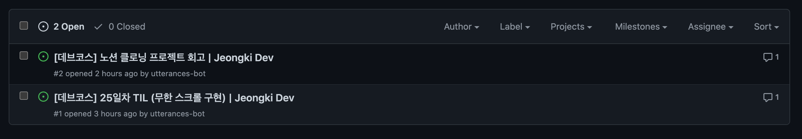
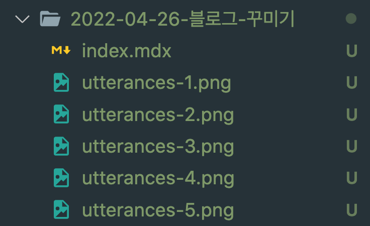

## 들어가며

목요일까지 제출해야 할 과제가 있다. 근데 오늘은 과제 하기가 뭔가 너무 귀찮다. 그래서 평소에 미뤘던 블로그 기능 추가를 해보기로 했다.

## 댓글 기능

원래는 댓글 기능을 한참 뒤에 추가하려고 했다. 블로그 방문자도 거의 없고 댓글로 소통할 일도 딱히 없다고 생각했기 때문이었다. 그런데 데브코스 시작한 지 한달이 넘어가고 다양한 분들과 소통하면서 댓글 기능이 필요할 것 같다고 느꼈다.

1. 블로그 글을 정리하는 이유는 개인적인 지식을 정리하는 것도 있지만 다른 사람들과 의견 교환의 목적도 있기 때문
   물론 많은 사람이 방문해서 댓글 기능이 필수라고 생각하지는 않는다. 그런데 최근 DFS/BFS 관련 정보를 검색하면서 한 블로그에 들어갔는데 DFS를 구현하는 방법으로 _queue_ 를 사용한다고 설명해 놓은 걸 보았다. **이건 잘못됐는데?** 라고 생각하면서 스크롤을 내렸는데 댓글로 이미 다른 분이 설명이 잘못된 부분이 있는 것 같다고 말씀해주셨다. 작성자 분은 댓글을 보고 글을 수정하셨고, 나중에 방문하시는 분들은 올바른 결과를 얻을 수 있을 것이다. 이 블로그를 방문하고 댓글의 필요성에 대해 확 깨닫게 된 것 같다. 댓글을 통해 내가 잘못된 정보를 작성했을 때 누군가 알려줄 수 있지 않을까?
2. 댓글을 통해 소통을 원하는 이미지를 만들 수 있을 것 같아서
   누군가 블로그를 방문했을 때 작성자와 소통할 수 있는 방법이 없다면, 소통하지 않겠다는 이미지를 심어줄 것 같았다. 소통하는 걸 좋아하기도 하고, 그런 이미지를 보여주기 위해서도 댓글 기능이 필요할 것 같다.

사실 기능 구현이라기보다 잘 만들어진 서비스를 가져다 사용하는거다. 내가 알고 있는 댓글 서비스로 _Disqus_ 와 _Utterances_ 가 있는데 개인적으로 _Utterances_ 를 많이 본 것 같아 **Utterances**를 사용하기로 했다.

### Utterances

Utterances는 깃허브 레포지토리에 이슈를 통해 댓글을 저장한다. 먼저 깃허브에 블로그 댓글을 저장할 레포지토리를 생성한다. 레포지토리 이름은 편한대로 정하면 된다. 단, _public_ 으로 설정돼 있어야 한다.  
  
다음으로 해당 레포지토리에 Utterances 앱을 설치해야한다.  

[설치 링크](https://github.com/apps/utterances)로 들어가면 Configure 버튼이 있는데 이 버튼을 누른다. 그러면 어떤 계정에 앱을 설치할지 선택할 수 있는데 위에서 만든 레포지토리가 있는 계정을 선택하면 된다. 그 다음 Only select repositories에서 위에서 만든 레포지토리를 선택하고 Install 한다.  

그러면 새로운 페이지로 이동하고 설정할 수 있는 화면이 나오는데 repo에 _깃허브계정/레포지토리 이름_ 형식으로 입력하고 아래에 있는 포스트와 깃허브 이슈 매핑 방법을 선택한다.  


총 6개의 방법이 있는데 상황에 따라 선택하면 된다고 한다. 나는 title 로 선택했다. 여기까지 선택했으면 아래에 있는 스크립트를 넣기만 하면 댓글 기능을 사용할 수 있다.

그러나 _React_ 로 개발한 경우 보안상의 이유로 inline으로 스크립트를 넣을 수 없다고 한다. 그렇기 때문에 따로 컴포넌트를 만들어 사용해야한다.

```javascript
export default function Utterances() {
  const comments = React.useRef();
  const [state, setState] = React.useState({ status: "pending" });

  React.useEffect(() => {
    const $script = document.createElement("script");
    $script.onload = () => setState({ status: "success" });
    $script.onerror = () => setState({ status: "failed" });
    $script.async = true;
    $script.src = "https://utteranc.es/client.js";
    $script.setAttribute("repo", "위에서 만든 레포 이름");
    $script.setAttribute("issue-term", "title"); // 매핑 방식
    $script.setAttribute("theme", "github-light"); // 테마
    $script.setAttribute("crossorigin", "anonymous");
    comments.current.appendChild($script);
  }, []);

  return (
    <div className="comments-wrapper">
      {state.status === "failed" && <div>Error. Please try again.</div>}
      {state.status === "pending" && <div>Loading script...</div>}
      <div ref={comments} />
    </div>
  );
}
```

이렇게 만든 컴포넌트를 필요한 곳에 _import_ 해서 사용하면 된다.
블로그 포스트에서 댓글을 작성하면 아래와 같이 레포지토리에 이슈가 생성된다.


## 블로그 포스트 구조 변경

원래는 _contents_ 라는 폴더 안에 _mdx_ 파일과 이미지 파일이 섞여 있었는데 각 포스트마다 폴더를 만들고 폴더 하위에 _index.mdx_ 라는 이름으로 파일을 만든다. 해당 포스트에서 사용할 이미지들을 같은 폴더에 넣어 저장하니까 훨씬 깔끔한 것 같다.  

_gatsby-config.js_ 파일에서 수정해야 할 줄 알고 정리를 미뤘었는데 따로 설정을 바꿀 필요는 없어서 간단하게 정리할 수 있었다.

## gif 파일 적용 안되는 문제

마크다운 내에 _gatsby-remark-images_ 를 사용하고 있는데 이 라이브러리는 gif를 지원하지 않는다고 한다. _gatsby-remark-interactive-gifs_ 라는 라이브러리는 gif를 지원한다고 해서 사용해봤는데 제대로 동작하지 않았다. 이건 다음에 좀 더 찾아봐야 할 것 같다.

## 다음에 더 적용할 것

요즘 CSS의 필요성을 정말 절실히 느낀다. 이번주 목요일부터 CSS 강의가 있는데 강의 열심히 들어서 블로그 디자인을 싹 바꾸고 싶다. 예전에 벨로그 디자인이 너무 마음에 들어서 이렇게 만들었는데 블로그 글을 보여주는 목적에는 조금 맞지 않는 것 같다는 생각이 든다. (특히 포스트 썸네일 부분. 지금은 그냥 포스트 제목을 반복해서 보여주는 용도밖에 안된다.)  
오른쪽에 떠다니는 TOC도 만들면 좋을 것 같다.

## 참고자료

utterances 설정 방법 블로그 https://sungchul-p.github.io/gatsby-utterances
