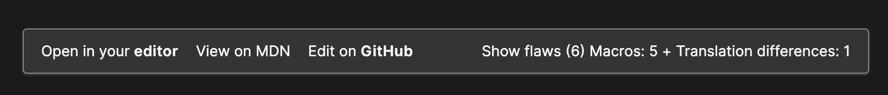
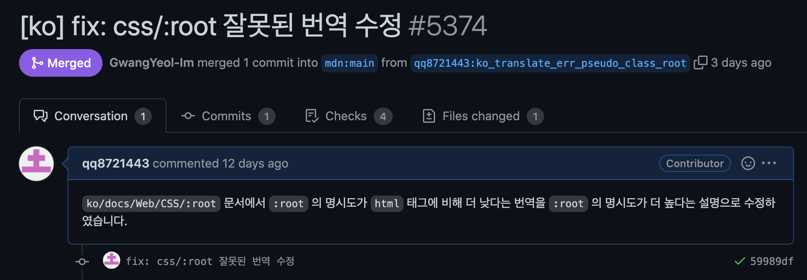
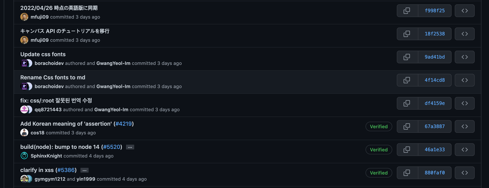
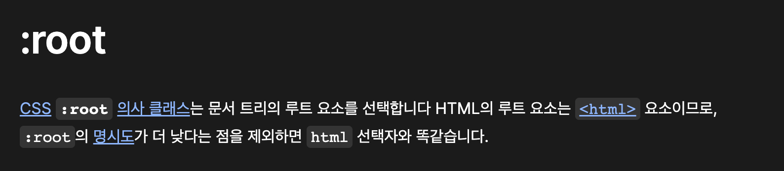
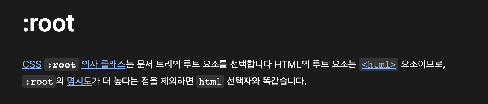

예전부터 오픈소스에 기여하고 싶다는 생각을 가지고 있었다. 그래서 깃허브를 기웃거렸던 적이 있는데, 실력도 없고 자주 사용하던 라이브러리도 없어서 딱히 기여할만한 게 없었다. 또, 이름은 오픈소스지만 기여를 하는 과정이 복잡했고 라이브러리 관리하는 사람들도 무서웠다. 괜히 내가 잘못 기여했다가 코드 망가지면 큰일이니까 그냥 포기했었다.   

그러던 중, 데브코스에서 CSS 강의를 듣는데 명시도 개념이 등장했다. 강사님은 당연히 알고 있어야 하는 것으로 설명하셨는데, 나는 대충 우선순위라는 것만 알았지 자세히는 전혀 몰랐다. _:root_ 의사 클래스 설명하시면서 명시도를 언급하셔서 mdn의 :root 문서를 읽어 보았다.   


그런데 문서의 설명이 뭔가 이상했다. 내가 이해한 바로는 **일반 요소 선택자 (html, h1 등, 일반 요소 선택자라는 말이 맞는지는 잘 모르겠다. 그냥 내가 지은 말임 ㅋ. MDN 문서의 경우 유형 선택자라고 함.) 의 명시도는 의사 클래스의 명시도보다 낮다**. 그렇기 때문에 CSS에 작성할 때 의사 클래스로 작성한 스타일이 우선해서 적용된다. _:root _ 의 경우 최상위 요소를 선택하는 의사 클래스인데, HTML 문서의 경우 html 태그를 가리킨다. 이때, html 태그는 일반 요소 선택자이고 :root는 의사 클래스이기 때문에 html의 명시도보다 :root의 명시도가 더 높다. 그런데 MDN 문서에서는 :root 가 html 보다 명시도가 낮다고 설명하고 있었다. 내가 잘못 이해했나 싶어서 명시도 관련해서 한시간정도 구글링 했던 것 같다. 아무리 찾아봐도 :root 의 명시도가 더 높은 것 같은데 뭐가 문제일까, 설마 명시도가 낮을 수록 우선 순위가 높다는건가, 내가 모르는 뭔가가 숨겨져 있나... 하는 고민에 빠져있었다.   

결국 결론은 MDN 문서의 번역이 잘못되었다는 것이었다. 이 쯤 되니까 '그냥 간단하게 원문을 보면 해결되지 않을까?' 하는 생각이 들었다. 
> The **_:root_**  CSS  pseudo-class matches the root element of a tree representing the document. In HTML, _:root_ represents the _<html\>_ element and is identical to the selector _html_, except that its specificity is higher.

원문을 아무리 읽어봐도 :root 의 명시도가 더 높다. 그래서 이번 기회에 오픈소스에 기여도 하고, 나같이 헷갈리는 사람이 없었으면 좋을 것 같아서 직접 문서를 수정해보기로 했다. 일단 MDN korea 오픈카톡방에 들어갔다. 사람들이 막 반겨줄 줄 알았는데 엄청 조용해서 아무 말도 못 꺼냈다. 다음 방법으로 깃허브에 정리되어 있는 [기여 가이드라인](https://github.com/mdn/translated-content/issues/827)을 참고했다. 생각보다 엄청 친절하게 정리해두셔서 놀랐다. 아래는 가이드라인의 내용을 정리한 것이다.
1. 오타나 번역이 잘못된 부분 등 수정이 필요한 부분을 찾는다.
2. _mdn/content_, _mdn/translated-content_ 두 개의 레포지토리를 내 레포지토리로 포크한다. 
	
3. 포크한 레포지토리를 로컬 저장소에 _git clone_ 한다.
	```
	git clone https://github.com/[본인 github ID]/translated-content
	git clone https://github.com/[본인 github ID]/content
	```
4. 로컬에 클론한 translated-content 폴더로 들어가서 작업할 브랜치를 새로 생성한다.
	가이드라인에서 브랜치 예시를 알려줘서 예시를 따라서 비슷하게 생성했다.
	```
	git checkout -b ko_type_err_promise
	```
	그런데 다른 분들 PR을 보니까 브랜치 이름에 크게 제약은 없는 것 같다. 내가 하려는 작업만 잘 명시해주면 될 것 같다.
5. content 폴더로 이동한다.
6. content 폴더 내에 _.env_ 파일을 생성하고 해당 파일에 아래와 같이 작성한다.
	```
	CONTENT_TRANSLATED_ROOT=/Users/tonybyeon/Desktop/translated-content/files
	EDITOR=code
	```
	_CONTENT\_TRANSLATED\_ROOT_ 에는 로컬의 translated-content 폴더 내의 files 폴더의 경로를 지정해준다. 나는 터미널에서 translated-content 폴더에 들어간 후 _pwd_ 명령어를 사용해서 경로를 붙여넣었다. _EDITOR_ 옵션은 사용하는 에디터에 따라 값이 달라진다고 하는데 나는 vscode를 사용하기 때문에 _code_ 라고 작성해주었다. 아마 이 과정은 영어로 된 원문과 번역본을 연결하는 과정인 것 같다.
7. content 폴더 내에서 yarn 명령어를 실행한다.
	```
	yarn install
	yarn start
	```
	yarn도 npm 처럼 패키지 매니저이다. yarn 이 설치되어 있지 않다면 **꼭 yarn 설치 후에 진행해야한다**. _yarn start_ 명령어를 실행하면 로컬 개발 서버에서 MDN 페이지에 접근할 수 있다.
8. http://localhost:5000/ko/  접속 후 수정하고자 하는 페이지에 들어간다.
	이때, 경로는 mdn의 문서 경로와 같다. 만약 https://developer.mozilla.org/ko/docs/Web/CSS/:root 해당 링크의 MDN 문서를 수정하고 싶다면 http://localhost:5000/ko/docs/Web/CSS/:root 로 들어가면 된다. (**포트 번호는 다를 수 있다. yarn start 명령어를 실행하면 어떤 포트가 열렸는지 알려주기 때문에 그 포트로 접근하면 된다.**)
	
9. 문서의 위쪽에 문서를 수정할 수 있는 버튼 목록이 있다. 나는 open in your editor 버튼을 눌러 vscode 에서 수정했다. 
    
10.  수정이 끝나면 translated-content 폴더에서 수정한 항목에 대해 커밋을 작성한다.
	커밋 메시지는 내가 무엇을 수정했는지에 대해 작성하면 된다고 한다.
11. 포크된 원격 저장소에 변경사항을 푸시하고 포크된 깃허브 translated-content로 접속한다.
12. contribute 버튼을 눌러 PR을 생성한다.
	base 를 _mdn/translated-content_ 의 _main_ 브랜치로 설정하고, compare를 포크한 레포지토리의 아까 앞에서 만들어두었던 브랜치로 설정하고 PR 메시지를 작성하면 된다. 아래는 내가 작성한 PR이다. 가이드라인에서는 번역 또는 수정한 내용을 사람들이 알 수 있게 작성하면 된다고 한다.  
    
13. 랜덤으로 리뷰어가 지정되고, 해당 리뷰어가 머지하거나 코멘트를 남길 때까지 기다리면 된다.
14. 변경 사항이 메인 브랜치에 머지 되었을 경우, 변경 사항이 웹에 적용되는 데까지 최대 2일이 걸릴 수 있기 때문에 반영될 때까지 기다리면 된다. 

## 결과
성공적으로 메인 브랜치에 머지 되었고, 수많은 커밋들 사이에서 내 커밋을 발견할 수 있었다. 

MDN 문서 내용도 변경된 것을 확인할 수 있다.
- 변경 전
    
- 변경 후
    

## 후기
사실 위에서는 뭔가 거창한 걸 한 것처럼 적어놨는데, 결과를 보면 알겠지만 딱 한 글자만 수정했다. 기여라고 할 것도 없지만 그래도 글을 작성하는 이유는 이 뿌듯함을 남기고 싶어서다. 문서를 읽다가 수정해야 할 부분을 발견하고 수정하고 PR을 날려서 실제로 적용이 된 과정에 스스로 매우 만족한다. 남들에게 도움이 될 수 있다고 생각하니까 더 뿌듯한 것 같다. 아마 이래서 사람들이 오픈소스에 기여하는게 아닐까 싶다. 지금은 이런 사소한 기여 밖에 할 수 없지만, 공부 열심히 해서 나중에는 더 많이 기여하고 싶다. 

## 참고자료
기여 가이드라인 https://github.com/mdn/translated-content/issues/827  
오픈소스에 기여하는 법 : MDN 문서에 기여하기 https://zaraza.tistory.com/58