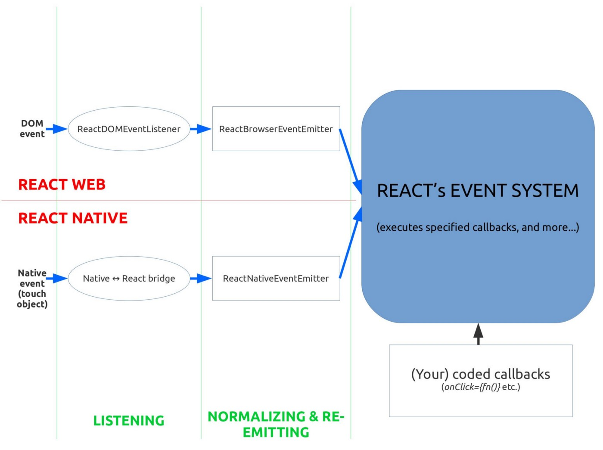
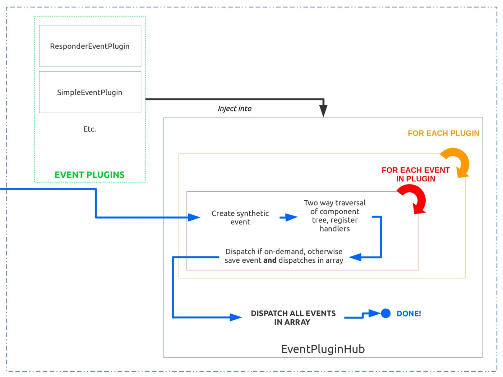

## 들어가며
55, 56일차 TIL을 작성하지 못했다. 55일차에 들었던 useHotKey 사용자 정의 훅 만들기 강의에서 _event_ 객체와 _event_ 객체 내부의 _event.nativeEvent_ 를 구분해서 사용했는데, 왜 구분하고 있는지에 대한 이해가 부족했다. 관련해서 구글링 해보았는데 원하는 답변을 찾을 수가 없었다. 한 번 궁금한 게 생기니까 다른 내용이 머릿속에 잘 들어오지 않았다. 해당 내용만 이해되면 바로 TIL 정리 하려고 했는데, 결국 이해를 하지 못해서 오늘까지 TIL을 쓰지 못했다... 오늘은 프로그래머스 강의장에서 오프라인으로 만나는 날이어서 버스 타고 가는 길에 관련된 내용이 갑자기 수루룩 이해가 되는 느낌을 받았다. 그래서 완벽하지는 않지만 리액트의 이벤트 객체에 대해 정리해보고자 한다.

## useHotKey
**useHotKey** 훅은 복잡한 단축키를 정의하고 해당 단축키가 눌렸을 때, 특정 이벤트를 실행하기 위해 사용한다. 페이지 어느 곳에서든지 단축키가 눌렸을 때 실행하는 global 단축키와, input, div 등의 특정 요소 내에서 단축키가 눌렸을 때 실행되는 local 단축키로 나누어 구현했다.   
키 입력을 받고, 해당 입력이 등록한 단축키와 같은지를 비교하게 되는데 비교하는 과정에서 global 단축키의 경우 _event_ 객체를 넘기고, local 단축키의 경우 _event.nativeEvent_ 객체를 넘긴다. 
```javascript
const handleGlobalKeyDown = useCallback((e) => {
	invokeCallback(true, getKeyCombo(e), 'onKeyDown', e)
}, invokeCallback)
  
const handleGlobalKeyUp = useCallback((e) => {
	invokeCallback(true, getKeyCombo(e), 'onKeyUp', e)
}, invokeCallback)
  
const handleLocalKeyDown = useCallback((e) => {
	invokeCallback(false, getKeyCombo(e.nativeEvent), 'onKeyDown', e.nativeEvent);
}, invokeCallback)
  
const handleLocalKeyUp = useCallback((e) => {
	invokeCallback(false, getKeyCombo(e.nativeEvent), 'onKeyUp', e.nativeEvent);
}, invokeCallback)
```
_handleLocalKeyDown_, _handleLocalKeyUp_ 함수에서 _e.nativeEvent_ 대신 _e_ 를 그대로 넘겨도 똑같이 동작한다. 그럼 왜 꼭 Local 단축키에는 _e.nativeEvent_ 를 붙이는걸까?

## 리액트 이벤트 객체
리액트에서 사용하는 이벤트 객체(e 또는 event)는 브라우저의 이벤트 객체와는 다른, 리액트만의 객체이다. 브라우저마다 이벤트 이름부터 이벤트 종류나 이벤트가 처리되는 방식이 다르다고 한다. 이를 동일하게 처리하기 위해 리액트는 **브라우저의 이벤트 객체를 래핑한 합성 이벤트를 사용**해 크로스 브라우징 문제를 해결했다. 
> 래핑이란?
> 소프트웨어에서 래핑은 기본 기능을 감싸는 새로운 기능을 만드는 것을 의미한다.

합성 이벤트 객체는 [W3 명세](https://www.w3.org/TR/uievents/#events-uievents) 를 따르기 때문에 브라우저의 고유 이벤트와 같이 사용할 수 있다.   
  
그럼 왜 브라우저의 네이티브 이벤트랑 똑같은 방식으로 사용할 수 있는데 특정한 상황에서는 nativeEvent를 사용해야 하는걸까? 이는 리액트 이벤트의 내부 동작을 확인해야 한다.  


리액트의 이벤트 핸들링 과정은 위와 같다. DOM 이벤트가 발생하면 리액트는 이벤트를 리스닝 하고 있다가 이벤트를 받아 합성 이벤트로 변환하는 과정을 거쳐 사용자가 작성한 함수 내에서 사용할 수 있게 한다. 합성 이벤트로 변환하는 과정은 조금 더 자세하게 나타낼 수 있다.  


위 그림을 보면 크게 _Event Plugins_ 와 _Event Plugin Hub_ 로 나눠져 있다. 이벤트 플러그인은 네이티브 이벤트를 받아서 _SyntheticEvents_ 를 생성하고, 이와 관련된 모든 dispatch (이벤트 핸들러에 전달한 핸들러 함수라고 생각하면 될듯? onClick={handleClick} 에서 handleClick) 를 수집하여 배열로 반환한다. 이 때 관련된 모든 dispatch를 수집하기 위해 캡처링, 버블링 페이즈로 DOM 트리를 두 번 탐색한다. 이 과정에서 **_stopPropagation_ 과 같은 인터럽션은 동일한 _SyntheticEvents_ 에 속한 함수의 실행만 방지한다.** 모든 이벤트 플러그인은 웹 또는 앱이 실행되자마자 이벤트 플러그인 허브에 주입되고, 설정 파일에 따라 플러그인이 정렬된다. 그리고 네이티브 이벤트를 받을 때마다 아래의 작업을 수행한다.  
각 플러그인 마다 순서대로 모든 _SyntheticEvents_ 와 관련된 dispatch를 수집하고 배열에 저장한다. 이후, 배열에 있는 이벤트와 관련된 모든 dispatch를 실행하고 배열에서 삭제한다.

## 결론
위에서 설명한 것처럼 _stopPropagation_ 과 같은 인터럽션은 동일한 _SyntheticEvents_ 에 속한 함수의 실행만 방지한다. 그렇기 때문에 의도하지 않은 동작을 할 수가 있다. global 단축키와 local 단축키를 생각해보면 global의 경우 document에 이벤트 리스너를 부착하고, local의 경우 특정 요소에 부착한다. 그렇기 때문에 global 이벤트의 경우 _stopPropagation_ 가 의도치 않은 방향으로 동작할 일이 없지만, local의 경우 의도치 않은 방향으로 동작할 위험이 있기 때문에 _e.nativeEvent_ 를 전달해서 원하는 대로 동작하도록 하는 것 같다.

## 정리
사실 지금도 잘 이해가 되지 않는다. 그래도 글로 정리하면서 정리하기 전보다는 훨씬 이해가 된 것 같다. 지금 당장 이해하기보다는 나중에 관련 내용을 접했을 때 조금 더 빠르게 이해할 수 있을 정도로만 공부해두면 좋을 것 같다. 내부 동작과 관련해서 글이 많이 없어서 교차 검증을 할 수가 없었다. 영어로 작성된 글이 조금 있었고, 한글로 작성된 글도 있었는데 한글로 작성된 글은 모두 같은 원문을 참조하고 있었다. 오랜만에 영어로 된 글을 처음부터 끝까지 읽어 봤는데 역시 영어는 너무 어렵다.  
사실 이틀동안 많은 걸 공부했는데, 배운 내용을 전부 정리하기에는 시간이 부족하고 괜히 정리하려다가 스트레스만 받을 것 같다. 나중에 다시 정리하는 걸로...

## 참고자료
https://levelup.gitconnected.com/how-exactly-does-react-handles-events-71e8b5e359f2  
https://floydkim.netlify.app/TIL/2019-09-28-TIL/  
https://medium.com/tapjoykorea/%EB%A6%AC%EC%95%A1%ED%8A%B8-react-%EC%9D%98-%EC%9D%B4%EB%B2%A4%ED%8A%B8-%ED%95%B8%EB%93%A4%EB%9F%AC-event-handler-syntheticevent-nativeevent-3a0da35e9e3f  
https://abangpa1ace.tistory.com/129  
https://ko.reactjs.org/docs/handling-events.html  
https://ko.reactjs.org/docs/events.html