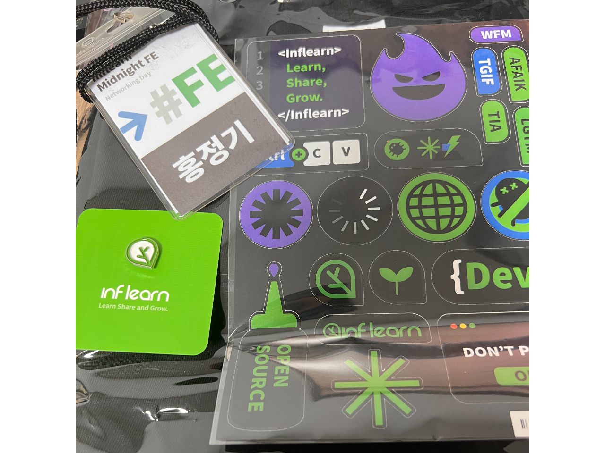
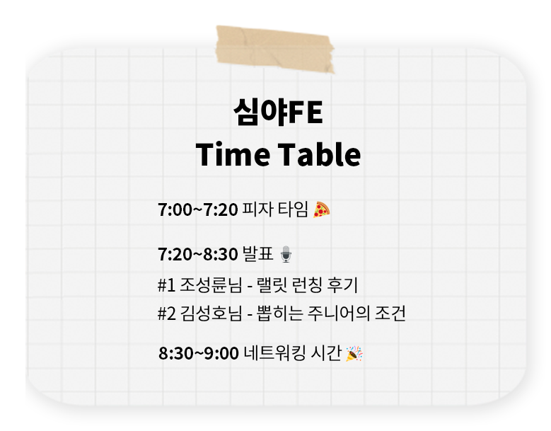
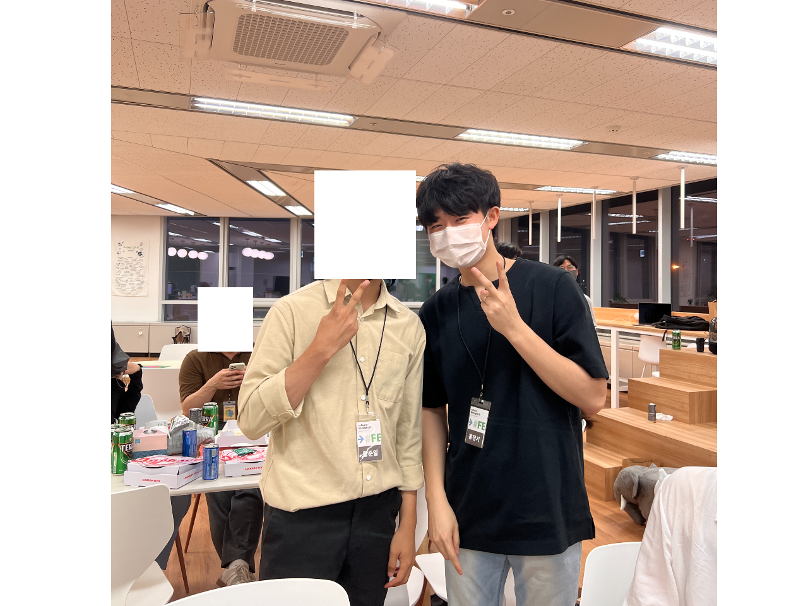
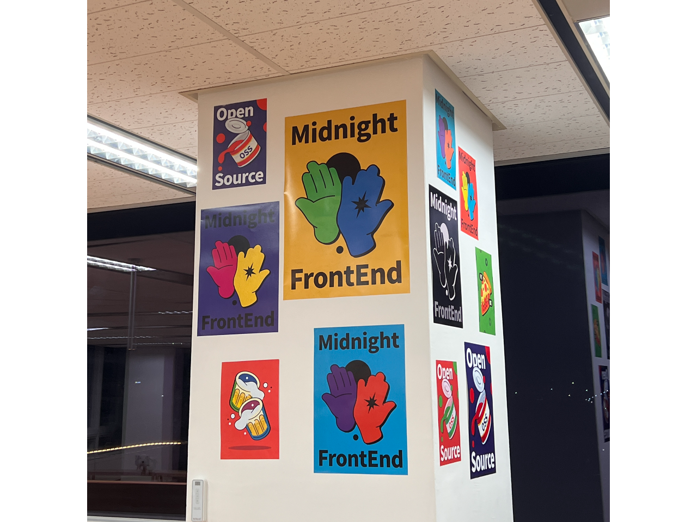

## 들어가며

최근에 운이 좋게 인프랩에서 주최하는 **심야 FE** 행사에 당첨되어 판교 인프랩 오피스에서 오프라인으로 세션도 듣고, 주니어 개발자분들과 이야기 할 수 있는 기회가 생겨서 다녀왔다. 행사가 오후 7시부터 시작이었는데 데브코스 코어타임이 7시까지라서 미리 판교 유스페이스 근처 카페에서 공부를 했다. 판교에 개발자들이 많아서 그런지 카페에서 코딩하는데 괜히 뭔가 눈치가 보였다. 판교에 자주 놀러다니긴 했었는데, 공부 목적으로 갔던 건 처음이라서 뭔가 어색했다. 호랑이 소굴에 들어간 느낌... 오후 2시부터 7시까지 카페에서 있었는데 계속 앉아 있으니까 허리가 아파서 빨리 7시가 되기만을 기다렸다.

## 인프랩 가는 길

6시 50분에 데브코스 출석 체크를 하고 바로 인프랩으로 달려갔다. 인프랩 오피스는 유스페이스 1A동 4층에 있는데, 유스페이스1 건물이 A동 B동으로 나뉘어 있어서 길 찾는데 꽤 시간이 걸렸다. 겨우 A동을 찾아 엘리베이터를 타고 인프랩 오피스에 도착했다. 도착하자마자 이름을 확인하고, 이름표와 티셔츠, 인프런 뱃지를 선물로 받았다.

그 후, 안내에 따라 내가 배정된 팀 자리로 이동했다.

## 행사 시작

팀원분들과 간단하게 자기소개하고 바로 행사가 시작됐다.  

무슨 생각이었는지 세션 내용을 정리를 안해뒀다... 다른 분들이 작성하신 좋은 글들이 있기 때문에 자세한 세션 내용은 링크로 대체하고자 한다.

- [인프런의 첫 네트워킹 데이 심야FE, 생생한 현장 스케치](https://velog.io/@sjoleee_/midnightFE-review#)
- [인프랩 심야 FE 네트워킹 데이 참여 후기](https://velog.io/@oneook/%EC%9D%B8%ED%94%84%EB%9E%A9-FE-%EB%84%A4%ED%8A%B8%EC%9B%8C%ED%82%B9-%EB%8D%B0%EC%9D%B4%EC%97%90-%EB%8B%A4%EB%85%80%EC%99%94%EC%8A%B5%EB%8B%88%EB%8B%A4)
- [인프런 심야 FE 후기](https://www.jaeme.dev/inflearn-fe/)

먼저 인프랩 프론트엔드 개발자인 조성륜님의 **랠릿 런칭 후기**를 들었다. 세션이 끝나고 기억에 남는 건 신입 개발자가 어떤 역량을 갖춰야 할 지에 대해 이야기 한 부분이었다. 깊이 있게 파고 들어서 공부하는 것이 중요하다는 맥락의 이야기를 하셨던 것 같다. (너무 오래전 일이라 기억이 가물가물하다...) 데브코스 세션 중에도 비슷한 이야기를 들었던 것 같다. 표면적인 지식 뿐만 아니라 한 두 단계 정도 더 깊이 들어가 공부하는 것이 중요하다는 내용이었는데, 그 내용과 일맥상통한다. 이런 면에서 나는 이런 역량을 지니고 있나 돌아보았다. 객관적으로 판단했을 때, 아예 없지는 않은 것 같다. 팀원 중 한 분과 인연이 있는, 인프랩에 입사한 지 약 4일 정도 된 개발자 분과 대화할 기회가 있었다. 이 분은 부트캠프를 수료하고 입사하신 분이었는데, 부트캠프 프로젝트 과정 중에 자바스크립트의 핵심까지 파고 들려고 하셔서 다른 팀원들이 왜 그렇게 까지 힘들게 하냐는 얘기를 했었다고 한다. 프로젝트 중에는 어떨 지 모르겠지만, 개인의 능력과 성장 면에서는 매우 좋은 습관인 것 같다. 아마 이런 면을 높게 평가해서 인프랩에 합류하지 않았을까... 생각해본다.

 

두 번째로 카카오엔터테인먼트 프론트엔드 리드 김성호님의 **뽑히는 주니어의 조건**이라는 주제의 세션이 진행됐다. 이력서, 포트폴리오, 사전과제, 면접 과정에서 중요하게 생각해야 할 부분들에 대해 설명해주셨는데, 아직 나는 한 번의 입사 지원도 해본 적이 없어서 내가 어떤 부분이 부족하고, 어떻게 보완해야 할 지가 아닌 말씀하시는 모든 부분을 충족해야한다고 생각하니 살짝은 부담이 됐다. 그래도 좋은 기업에 나를 알리려면 꼭 챙겨야 하는 부분이기 때문에 차근차근 챙겨보려고 한다. 성호님께서 **프론트엔드 개발자는 사용자를 위한 UI/UX 를 고려하는 게 매우 중요하다** 라는 말씀을 해주셨다. 나만 그런지는 모르겠지만, 프론트엔드 기술에 어느 정도 익숙해지면 당연하게 백엔드 기술을 공부해야겠다고 생각하고 있었다. 성호님의 말씀은 신선한 충격이었다. **프론트엔드 개발자는 사용자가 원하는 정보를 어떻게 잘 제공하는지에 대한 일을 한다** 라고 데브코스 면접 때 이야기 했던 것 같다. 이런 부분에서 UI/UX는 프론트엔드 개발자가 항상 고민해야 할 부분인 것 같다. 그렇기 때문에 사용자의 경험을 고려하는 것은 아무리 좋은 프론트엔드 도구가 등장한다고 하더라도 프론트엔드 개발자가 지향해야 할 핵심적인 가치라는 부분에서 인상 깊었다.

## 네트워킹 시간

두 번의 세션이 끝나고, 팀원들과 자유롭게 이야기하는 시간을 가졌다. 우리 팀에는 주니어 개발자 3명, 나 포함 취준생 2명, SI에서 서비스 회사로의 이직을 준비하시는 시니어 개발자 1명이 있었다. 약 9시부터 11시 20분쯤까지 꽤 오랫동안 다양한 얘기를 했다. 얘기하면서 느낀 건 사람들 모두 열정이 엄청나다. 내 주변 친구들을 보면 이렇게 열정적인 사람은 없었던 것 같다. 다들 본인이 하고 있는 일에 만족하고, 어떻게 하면 더 성장할 수 있을까를 끊임없이 고민하는 모습을 보고, 내가 개발 분야를 선택한 건 잘한일이구나 라는 생각을 하게 되었다. 물론 모든 개발자가 열정이 있는 건 아닐 것이다. 또, 대부분 주니어 개발자가 모인 자리였기 때문에 더 그럴 수도 있었을 것이다. 그래도 이런 분위기를 볼 수 있다는 것 자체가 이 분야의 장점이라고 생각한다.

## 데브코스 1기 손수림 님을 만나다

데브코스 1기를 수료하신 [손수림](https://github.com/sonsurim) 님을 만났다. 만나 뵙고 인사하고, 나중에 같이 사진 찍으려고 했는데, 수림님께서 먼저 가셔서 사진을 못 찍었다. 다음에는 꼭 같이 사진 찍어야지...
수림님을 보고 놀랐던 점은 질문을 많이 한다는 것이었다. 세션마다 많은 질문을 해주셔서 놀랐다. 나는 세션을 들어도 어떤 질문을 해야할까 떠오르지가 않는데 질문하시는 분들 보면 대단한 것 같다. 개발을 잘하는 사람이 질문을 잘하는 걸까, 질문을 잘하는 사람이 개발을 잘하게 되는 걸까?

## 개발자 황준일 님을 만나다

몇 달 전, 바닐라 자바스크립트 노션 클로닝 프로젝트를 진행하는 과정에서 아래의 블로그와 블로그 글을 많이 참고했다.  
[Vanilla Javascript로 웹 컴포넌트 만들기](https://junilhwang.github.io/TIL/Javascript/Design/Vanilla-JS-Component/#vanilla-javascript%E1%84%85%E1%85%A9-%E1%84%8B%E1%85%B0%E1%86%B8-%E1%84%8F%E1%85%A5%E1%86%B7%E1%84%91%E1%85%A9%E1%84%82%E1%85%A5%E1%86%AB%E1%84%90%E1%85%B3-%E1%84%86%E1%85%A1%E1%86%AB%E1%84%83%E1%85%B3%E1%86%AF%E1%84%80%E1%85%B5)  
내가 필요했던 정보가 있기도 했고, 알고 있는 지식을 깔끔하게 정리해 둔 것을 보고 블로그를 정주행 했었다. 많은 도움을 받아서 감사하게 생각하고 있었는데, 이번 행사에 오셔서 사진도 찍고 얘기도 많이 했다. 도움이 되는 많은 얘기를 해주셔서 정말 감사하게 생각하고 있다.  

## 정리

다양한 사람들과 이야기하면서 생각의 범위가 넓어진 것 같다. 원래 이런 행사를 가 볼 생각을 못했는데 이번 행사를 계기로 다양한 사람들과 만날 수 있는 기회가 더 많았으면 좋겠다.  

