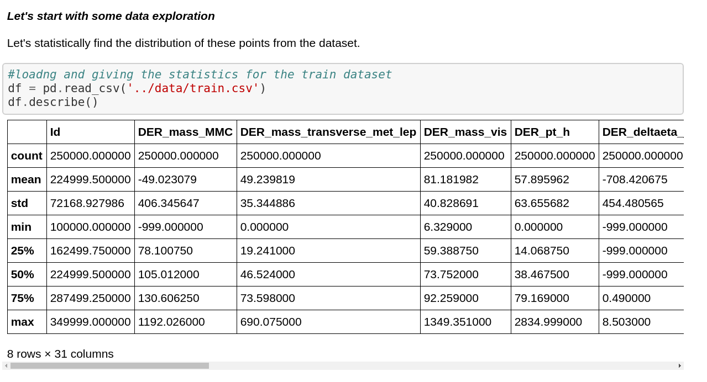

## 들어가며

오늘은 첫 데이터 시각화 강의를 들었다. 프론트엔드에서 데이터 시각화는 매우 중요하다고 생각한다. 사용자에게 데이터를 어떻게 보여주느냐에 따라서 정보를 더 잘 전달할 수 있기 때문이다. 이 부분도 사용자 경험을 위해 필요한 게 아닐까 생각해본다.

## 데이터 시각화

데이터 시각화란 말 그대로 수많은 데이터 속에서 정보를 찾고 시각화 하는 것이다. 시각화가 효과적인 이유는 데이터에 형태를 부여하여 사용자로 하여금 데이터를 한눈에 파악할 수 있도록 하기 때문이다.

### 데이터 시각화 구성

데이터 시각화의 전체적인 구성은 다음과 같다.

1. 데이터
   가장 먼저 데이터를 확보해야 한다. 이 때, 유용한 데이터가 많으면 많을 수록 좋다.
2. 독자
   데이터 시각화를 진행하면 이 자료를 보는 독자가 있을 것이다. 누가 흥미를 가질지, 누구에게 도움이 될 지 등 독자의 니즈를 파악해야 한다.
3. 구성
   어떻게 구성하는 지도 중요하다.
   1. 데이터에서 출발: 데이터 분석 없이 측정 가능한 수치 값을 찾고 이를 각각 시각화 할 수 있다. 데이터 그 자체를 내용으로 구성하는 방법이다.
   2. 분석에서 출발: 주어진 데이터를 분석하고 증명한 다음 결론을 내는 방법이다. 따라서 시각화의 내용에 분석 과정이 많이 담기게 된다.

### 좋은 데이터 시각화란?

1. 풍부하고 유용한 데이터
2. 명료하고 보기 좋은 시각화
3. 한 눈에 내용이 잘 전달되는 구성

> 명료하고 보기 좋은 시각화
>
> 1. 주제에 따른 정말 필요한 정보만을 보여줌
> 2. 독자의 인지를 해치지 않는 적절한 시각적 속성 구성
> 3. 군더더기 없는 부가 설명 포함

### 데이터 시각화 구성 요소

데이터 시각화의 구성 요소는 데이터 측면과 시각적 측면으로 나눌 수 있다.

1. 데이터 측면
   데이터 시각화를 위해 가장 먼저 데이터가 필요하다. 시각화에 사용하는 데이터를 **데이터셋**이라고 한다. 하나의 컬럼을 데이터 변수라고 하고, 컬럼 내의 값을 데이터 값이라고 한다.
   
   데이터는 **정량적 데이터**와 **정성적 데이터**로 나눌 수 있다.

   1. 정량적 데이터
      숫자형 데이터를 의미한다. 통계를 내거나 계산이 가능하다. 정량적 데이터는 연속형 데이터와 이산형 데이터로 나눌 수 있다.
   2. 정성적 데이터
      범주형 데이터를 의미한다. 숫자로 환산할 수 없다. 예를 들어 개/고양이, 좋음/나쁨 등이 정성적 데이터이다. 순서가 있는 범주인 순위형 데이터와 순서가 없는 범주인 명목형 데이터로 나뉜다.

2. 시각적 측면
   시각적 측면에서 차트를 구성하는 작은 단위를 시각적 속성이라고 한다. 시각적 측면에서의 구성 요소는 위치, 형태, 크기, 색, 선 굵기, 선 유형 등이 있다.

데이터와 시각적 속성을 연결하기 위해서는 척도가 필요하다.

1. 위치 스케일: 차트 안에서 데이터 값의 위치를 지정한다. 보통 데카르트 좌표계(직교 좌표계)를 사용한다.
2. 색상 스케일: 색상을 통해 나타낼 수도 있다. 색을 사용하는 경우 - 데이터 군을 서로 구분하기 위해 - 데이터 값을 나타내기 위해 - 데이터 값을 강조하기 위해
   사용한다고 한다.

### 그 외 요소들

1. 범례: 다양한 항목들을 식별할 수 있게 도와줌
2. 툴팁: 시각화에 마우스를 올렸을 때 해당 데이터를 말풍선으로 보여줌
3. 라벨: 차트에 대한 부가 정보를 텍스트로 보여줌

### 다양한 데이터 시각화 종류들

데이터 시각화에는 다양한 방법이 존재한다. 어떤 데이터를 보여줄 지에 따라 데이터를 더 잘 나타낼 수 있는 방법들이 존재한다.

1. 수량을 보여주려면?
   주로 표나 막대 차트를 사용한다.
2. 비율을 보여주려면?
   파이 차트, 누적 막대 도표, 모자이크 도표, 트리맵 등을 사용한다.
3. 시계열과 추세를 보여주려면?
   선 그래프를 사용한다.
4. 지리공간을 시각화하려면?
   대표적으로 단계구분도를 사용한다. 이 때, 지도의 형태를 꼭 유지해야 하는 건 아니기 때문에 카토그램이나 카토그램 히트맵 등을 사용하기도 한다.
5. 그 외
   평행 집합이나 워드 클라우드 등을 사용하기도 한다.

### 효과적인 시각화를 위해 알아두면 좋을 6가지

1. 선형 스케일 차트는 항상 0에서 출발해야 한다. 0에서 시작하지 않으면 데이터 값을 비교할 때 부정확한 정보를 제공할 가능성이 있다.
2. 무분별한 색 사용은 오히려 시각적인 혼란을 불러 일으킨다.
3. 색각 이상자를 배려한다.
4. 제목을 적당히 활요한다. 차트 상단에 제목을 달면 독자가 차트에 접근하고 이해하는 시간이 짧아진다. 단, 무분별하게 사용하면 오히려 지저분해 보일 수 있다.
5. 테두리와 격자를 적당히 활용한다. 이때, 데이터가 명확히 보이는 한도 내에서 사용해야 한다.
6. 3D로는 시각화 하지 말자. 이점이 딱히 없다.

## 정리

드디어 데이터 시각화 파트에 도착했다. 지금까지는 다른 공부하기 바빠서 데이터 시각화는 쳐다보지도 못했었다. 이렇게라도 강의로 공부할 수 있는 기회가 생겨서 너무 좋다. 데이터 시각화 강의에서 _D3_ 라는 자바스크립트 시각화 라이브러리를 사용한다고 하는데, 예전부터 써보고 싶다는 생각이 있어서 더 좋은 기회인 것 같다. 리액트를 사용해서 화면을 구성할 때에도 그렇고, 데이터 시각화 파트에서도 그렇고 프론트엔드의 메인 관심사는 항상 사용자에게 좋은 경험을 제공하는 것이라고 생각한다. 오늘 강의에서 데이터 시각화 과정에서 색각 이상자를 배려한다는 점이 기억에 남는다. 생각해보지 않았던 부분이라 더 그런 것 같다. 항상 사용자를 생각하는 프론트엔드 개발자가 될 수 있도록 노력해야겠다.

## TMI

데브코스 기간 중 처음으로 번아웃이 온 것 같다. 저번주 강의에 공부할 내용이 많았는데, 공부도 제대로 못하고 TIL도 작성하지 못해서 개인적으로 자괴감이 들었는데, 가용할 수 있는 자괴감을 넘어서 급 공부가 하기 싫어졌다. 공부 해야하는데... TIL 써야하는데... 하고 스트레스 받다가 스트레스를 안 받기 위해서 공부를 포기해버린 느낌? 번아웃 그 자체로 봤을 때는 안 좋은 징조지만, 이걸 극복하는 과정까지 생각했을 때는 한 번 쯤 겪어보면 좋은 것 같다. 연애 중에도 **잘 싸우는 게 중요하다**라는 말이 있는 것처럼 나도 번아웃과 잘 싸우는 게 중요할 것 같다. 일단은 강의를 듣되 깊게 공부하는 것보다는 큼직한 키워드 중심으로 공부하기로 결심했다. 지금까지는 약간 **강의에서 나온 모든 내용을 이해하고 TIL도 작성해야지!** 라는 느낌으로 공부했다면, 지금은 **나중에 공부할 때 더 쉽게 하기 위해 정리해두는 정도?** 라는 생각을 가지고 공부할 생각이다.

 

번아웃을 핑계로 주말에 친구들을 만났다. 운이 좋게도 친구 중에 [SWC](https://github.com/swc-project/swc)를 개발한 친구가 있어 개발적으로 많은 도움을 얻는다. 이번에 만나서 요즘 어떤 개발하고 있는지, 나는 프로젝트를 어떻게 완성했는지, 어떤 오픈 소스 프로젝트를 하면 좋을지 등을 얘기하면서 번아웃을 조금은? 극복한 것 같다. 많은 얘기를 하면서 내린 결론은, 이번 주는 강의에 집중하기 보다는 그 동안 미뤄 왔던 내가 하고 싶은 개발을 하기로 했다. 블로그 기능도 추가하고 디자인도 변경하고, 바닐라 js 강의 때부터 미뤄 왔던 토이 프로젝트도 다시 진행해보고 싶다. 하고 싶은 개발을 하다보면 자연스레 번아웃을 극복할 수 있지 않을까 기대하고 있다!

## 참고자료

프로그래머스 데브코스
